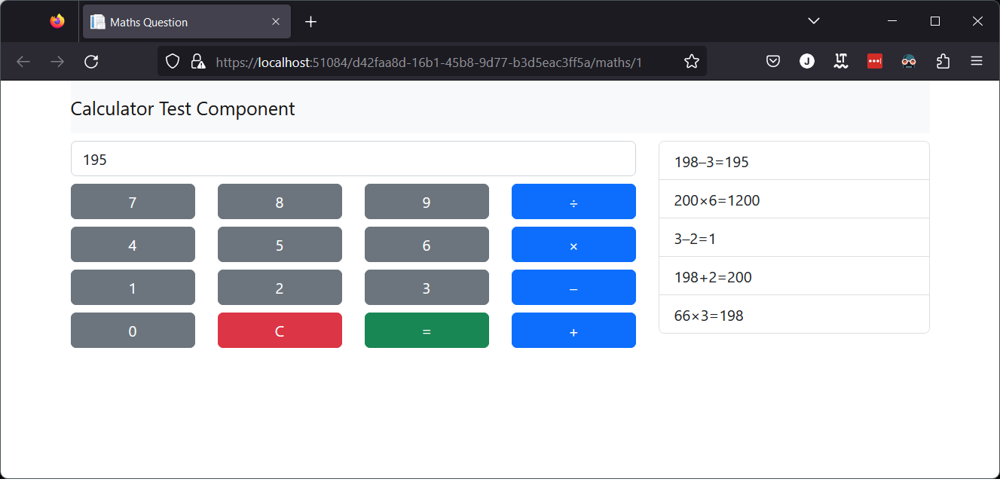

# Cherrybakewell Calculator 🤵

### Development Setup 🛠

##### Requirements

-   Visual studio 2022
-   Node v16.14.2
-   Docker
-   Angular CLI

##### Steps

1. Open [CherryBakewell.sln](CherryBakewell.sln) file in Visual Studio
2. Install npm packages in [src/CherryBakewell.Web/](src/CherryBakewell.Web/)
```bash
npm install
```
3. Build front end in [src/CherryBakewell.Web/](src/CherryBakewell.Web/)
```bash
ng build
```
4. Select docker-compose as the startup project and run. This will build/run the container for the website and a sql container. Ignore the propped up browser window for now.
5. Run DatabaseQuickCreateAndMigrate console application. This will bootstrap a development database in the docker container.

### Pages 📃

#### Calculator




### Notes ✏

- Missing security hardening or any authentication
- Only got default BS5 theme
- Validation would need to be added
- Logging & propper error handling missing
- I would generally split up the angular side into more components

### Disclaimer 🤣

First time with Dapper or Angular